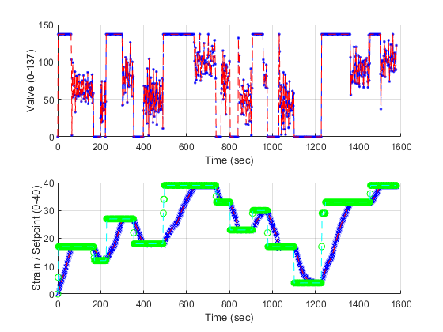
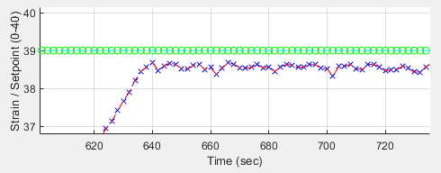

# Water-Tank-Control-Project

## Current Status:

**[As of 2/23/2023]**

1. Was able to sucessfully conduct serial communication between two devices. In this case, between an Arduino and a personal computer in order to transfer data and store in a MATLAB friendly file for future analysis.

2. Produced a decent discrete transfer function model $G[z]$ with data collected being feed and used inside the MATLAB system identification application. Each construction and variation of tank / motor / motor distance will result in different dicrete transfer functions, but my specific transfer function was:

$$G[z] = \frac{0.003419683395759z-0.003404915952542}{z^2-1.987115795703846z+0.987183059301988}$$

2. **NOTE:** The prior transfer function is the result of below continous transfer function from with system idenfitication then converted to discrete with a zero order hold (ZOH) which is the default and approxipriate conversion performed with the c2d() function.

$$G(s) = \frac{0.001717189366905s+0.000003715745070}{s^2 + 0.006449893164376s + 0.000016924688958}$$

2. Where the developed $G(s)$ had a Fit of 85.65%, FPE of 3.4, and MSE of 3.335 (good enough for me especially given the transfer function isn't too complicated with only one zero and two poles). The transfer function model was developed with data that does not take into consideration the nonlinear effects of the motor requiring a minimum amount of power to push water into the tank sucessfully (after all, we are using mathematical technqiues that apply for linear systems). Instead the data production was changed where "zero" was when the motor was barely not able to poor water into the tank (still powered), NOT absolute zero where the motor has no power.

3. Sucessfully was able to implement a P-Controller (Proportional Only Controller) from standard PID-Controller (Proportional-Integral-Derivative Controller). Steady state error is observed which require utilization of an PI-Controller to resolve in the future. The P constant was determined by utilizing the MATLAB PID tuner application with the $G[z]$ developed to model the plant in the discrete domain. $P = 226.779$ was the tuned proportional gain obtained. In the future may implement a PI controller instead to reduce the steady state error of the control system to that of just the error of the strain sensor itself.

**For the below image:**
-Blue data represents actual data, whereas red data is preprocessed interpolated data for system identification purposes (not as necessary as it was early on in the project when there was no sample time regulation).
-Top subplot: Shows how much power the liquid pump is given between the integer values 0-137 called valve.
-Bottom subplot: Shows what the current strain value is in the blue/red curve and what the setpoint for that moment in time is in green.

**For the below image:**
-Green is still the setpoint as in the prior image, whereas the blue curve and red curve represents the strain for a given time. This image is a portion of the above image. The zoom allows to view the steady state error that exists between a setpoint and a strain not visible in the prior image. This error exists at all the regions where it appears the setpoint and strain meet in the prior image not just around $strain = 40$ where the system starts to each its physical limits.

## Using the Programs

1. The "Prelimiary_Tests" directory is intended for setting up circuits and to view the limits of the system. In my implementation, I utilized a 20 Kg loadcell connected to HX711 circuit that converts the strain guage signals into an accessible amplified binary value via an HX711 Arduino library, and the TB6612FNG motor driver to control a small submersable DC pump with PWM signals. To ensure the pump works after making all the connections run the "water_pump_test.ino" and play with the potentiometer. The motor should be changing its sounds to be higher pitch with the bigger duty cycle PWM signals if outside of water, and more water should be moved if in water. Note: Limit the amount of out of water testing as pumps are not intended to be ran for long periods of time outside of water. This test also serves to find what PWM accuation signal is the minimum required for the pump to barely not be able to push water into the tank as is necessary for transfer function crafting (Using the Arduino IDE Serial Monitor). In my case, a PWM signal of 118 (an Arduino analogWrite() int strength argument for a 490 Hz signal) was the value of interest. This value will vary depending on how effective the liquid pump is as well as how height water has to be pushed by the pump to enter the tank. The other test is the "strain_sensor_test.ino" that allows for checking correct wiring. In this test, the loadcell can be strained by hand to confirm the strain is capable of making reasonable measurments (Using the Arduino IDE Serial Monitor confirm no unintended data spikes and that increasing force in a given spot causes increased magnitude of strain).

2. The "System-Idenfitication" directory contains the code to generate and send the data from the system needed to be able to construct a transfer function with the MATLAB system identification application. An important nuance is that for the section of code the "minimum required for the pump to barely not be able to push water into the tank" value is needed to be taken into account. Potenitometers using 5 volts have an integer range from 0-1023. The analogWrite() function provided by the Ardunino library runs with an argument of 0-255. In my case a analogWrite() value argument of 118 is my "minimum required for the pump to barely not be able to push water into the tank". This means 0-1023 should map to 118-255, but for transfer function purposes I need a zero value to exist. 118-255 has the same range as 0-137. It is most convenient to map the 0-1023 from a potentiometer into the valve data to be used in transfer function making to 0-137 and then to map said 0-137 to the 118-255 actually used by the Arduino to drive the motor. This can be seen in the "merged_roles.ino" valve section of code. This should will be made easier in the future. For now the mapping must be made manually for a given "minimum required for the pump to barely not be able to push water into the tank". After confirming all is in working order with the Serial Monitor and playing around with the starting the system with a button push, stopping the system with the button, controlling pump strength witht the potentiometer, and obtaining reasonable strain values, the it is time is more seriously collect data for analysis. Ensure that all Serial Monitors are closed, restart the Arduino/Recompile the code, and run from the "Personal-Computer" directory the program "serial_receiver.py". This program will listen to incoming data whenever a message is first heard (after pushing the start button the Arduino is listening for). Play with the potentiometer and generate random inputs as is seen fit (prefereably slowly as the default sampling rate is a sample every two seconds). After a good range of water height levels as pump strengths are covered simply hold down the same button that was used to start the data production so that the Arduino sends a message to the "serial_receiver.py" program to stop listening for messages and to store the data in a ".mat" file. View the data produced as a ".mat" file in MATLAB using the "data_polishing.m" script and confirm that the data is reasonable. If data spikes and excessive noise is observed from typically the strain guage, it is possible that electromagnetic interference (EMI) is being capatured. In my case, a poweroff_delay of 500 ms was sufficient so that the motor fully stops and no EMI is experienced during data sampling. This may not be the case for other motors and the time will have to be increased. A difference poweroff_delay comes with a potential need to increase the powered_delay and subsequently the sampling_time_ms to support the new delays. In addition chaning these variables will no doubt result in a different "minimum required for the pump to barely not be able to push water into the tank" value that needs to be accouted for. If no issues were observed with the strain data with the default poweroff_delay and powered_delay and sampling_time_ms then simply proceed to collect more data. I recommend collecting one data set where the potentiometer a step input from maximum to minimum input where the water tank is allowed to travel its full range, and another data set where the potentiometer is set to random values, but the water tank is allowed a to travel its full range in that data set as well. In MATLAB system identification use the step input based data as the real data and use the more complex random input data as the validation data. This produced a reasonably accurate continous transfer function which isn't needlessly complicated. Convert the continous transfer function $G(s)$ into a discrete one $G[z]$ with a zero-order hold incorporated by using the function c2d() (zero-order hold is the default conversion method). Save these transfer functions manually as the full precision is important especially when the transfer function poles are incredibly close to being marginally stable / unstable. With a reasonable transfer function utilize Simulink and the PID tuner app to design a controller. Ensure that saturation between the valve values specified in "Arduino/System_Identification" are used, in my case that was 0-137 (recall that this 0-137 was merely a convenience in transfer function making that actually means 118-255 in a actual accuation signal to the liquid pump). From the MATLAB PID tuning app I decided to use a P controller only and had obtained a $P = 226.779$ and used this in my next Arduino program.

3. The "P-Controller-System" contains incredibly similar code to the "System-Identification" except that the potentiometer acts as the setpoint of what strain value should be the target, the valve values are generated from the error signal being fed to the P-Controller, and additional setpoint data being sent over the USB wire requiring the usage of "serial_receiver_v2.py" and "data_polishing_v2.m" rather than the non "_v2.*" counterpart.
